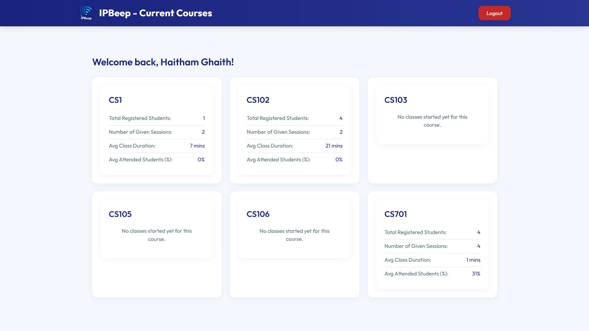

# 🌐 IpBeep - Smart Attendance System Web Interface

IpBeep is a modern web application that serves as the instructor's control panel for managing smart attendance sessions. Built with React and Firebase, it provides a seamless interface for course management, session control, and attendance analytics.

## 📸 Screenshots

| Login Page | Courses Page |
| :---: | :---: |
|  |  |

| Running Session | Session Details |
| :---: | :---: |
|  |  |

| Student Attendance | Help Page |
| :---: | :---: |
|  |  |

| Modify Attendance | Network Info |
| :---: | :---: |
|  |  |

## 🔧 Features

### 📚 Course Management
- Create and manage multiple courses
- View course statistics and attendance history
- Real-time session monitoring
- Beautiful course cards with interactive animations

### 🎯 Session Control
- Start and end attendance sessions
- Configure session parameters (duration, threshold)
- Real-time attendance tracking
- Automatic Wi-Fi network setup (SSID: `IpBeep-Network`)
- Secure password generation for network access

### 📊 Analytics Dashboard
- Visual attendance statistics
- Interactive pie charts for attendance overview
- Detailed student presence tracking
- Session history and reports

### 🔐 Security
- Firebase Authentication integration
- Secure session management
- Protected routes and API endpoints
- Real-time data synchronization

## 🛠 Technical Stack

- **Frontend**: React.js with Vite
- **Styling**: Tailwind CSS
- **Animations**: Framer Motion
- **Charts**: Chart.js
- **Backend**: Firebase
  - Authentication
  - Firestore Database
  - Real-time Updates
- **Deployment**: Vercel/Netlify

## 📦 Project Structure

```
src/
├── assets/            # Static assets (images, etc.)
├── components/         # Reusable UI components
├── context/           # React context providers
├── firebase/          # Firebase configuration and initialization
├── pages/             # Page components for different routes
├── services/          # Business logic (auth, database queries)
├── App.jsx            # Main application component with routing
├── main.jsx           # Root React render entry point
└── index.css          # Global styles
```

## 🚀 Getting Started

### Prerequisites
- Node.js (v16 or higher)
- npm (v7 or higher)
- Git

### Installation & Setup

1.  **Clone the repository**
    ```bash
    git clone https://github.com/yourusername/IpBeep-Web.git
    cd IpBeep-Web
    ```

2.  **Install dependencies**
    ```bash
    npm install
    ```

3.  **Configure Firebase**
    - Go to the [Firebase Console](https://console.firebase.google.com) and create a new project.
    - In your project settings, add a new web app.
    - Copy the Firebase configuration object.
    - Create a `.env.local` file in the root of your project.
    - Add your Firebase credentials to the `.env.local` file like this:
      ```env
      VITE_FIREBASE_API_KEY=your_api_key
      VITE_FIREBASE_AUTH_DOMAIN=your_auth_domain
      VITE_FIREBASE_PROJECT_ID=your_project_id
      VITE_FIREBASE_STORAGE_BUCKET=your_storage_bucket
      VITE_FIREBASE_MESSAGING_SENDER_ID=your_messaging_sender_id
      VITE_FIREBASE_APP_ID=your_app_id
      ```
    - **Important:** The `.env.local` file is already in your `.gitignore` to prevent you from accidentally committing your secret keys.

4.  **Set up Firestore and Rules**
    - In the Firebase Console, go to the "Firestore Database" section and create a new database.
    - Go to the "Rules" tab and paste the contents of the `firestore.rules` file from this repository.
    - Deploy the rules using the Firebase CLI if you have it installed (`firebase deploy --only firestore:rules`).

5.  **Start the development server**
    ```bash
    npm run dev
    ```
    The application will be available at `http://localhost:5173`.

### Development Scripts

```bash
# Start development server
npm run dev

# Build for production
npm run build

# Preview production build
npm run preview

# Run linting
npm run lint

# Deploy to GitHub Pages
npm run deploy
```

## 🔄 Integration with Raspberry Pi

The web application works in conjunction with the [IpBeep Raspberry Pi system](https://github.com/HaithamGhaith/IpBeep-PI-Side):

1. **Session Configuration**
   - Instructor creates a session through the web interface
   - Configuration is stored in Firebase
   - Raspberry Pi fetches configuration and starts the session

2. **Attendance Tracking**
   - Students connect to the Pi's Wi-Fi network
   - Face recognition and MAC tracking begin
   - Real-time updates are pushed to Firebase
   - Web interface displays live attendance data

3. **Session Completion**
   - Instructor ends the session through the web interface
   - Pi finalizes attendance logs
   - Data is synchronized to Firebase
   - Analytics are updated in real-time

## 📱 Features in Detail

### Course Management
- Create new courses with unique identifiers
- View course statistics and history
- Manage multiple sections
- Track attendance patterns

### Session Control
- Start/stop attendance sessions
- Configure session parameters
- Monitor real-time attendance
- Generate secure Wi-Fi passwords

### Analytics
- Visual attendance statistics
- Student presence tracking
- Session history
- Export capabilities

## 🔒 Security Features

- Firebase Authentication
- Protected routes
- Secure session management
- Real-time data validation
- Encrypted communications

## 🎨 UI/UX Features

- Modern, responsive design
- Smooth animations and transitions
- Interactive data visualizations
- Intuitive navigation
- Dark/Light mode support

## 📈 Firebase Structure

### Collections

1. **courses**
   - Course information
   - Section details
   - Statistics

2. **sessions**
   - Session configuration
   - Attendance data
   - Timestamps

3. **users**
   - Instructor profiles
   - Authentication data
   - Permissions

## 🚀 Deployment

1. **Build the application**
```bash
npm run build
```

2. **Deploy to Vercel/Netlify**
- Connect your repository
- Configure environment variables
- Deploy

## 🤝 Contributing

1. Fork the repository
2. Create your feature branch
3. Commit your changes
4. Push to the branch
5. Create a Pull Request

## 📝 License

This project is licensed under the MIT License - see the LICENSE file for details.

## 👥 Authors

- Haitham Ghaith & Khalid Barham - Initial work

## 🙏 Acknowledgments

- Firebase team for the amazing platform
- React community for the excellent tools
- All contributors who have helped shape this project

---

Built with ❤️ for better education

## 🔒 Security and Configuration

### Firebase Security

1. **Never commit Firebase credentials**
   - Keep all Firebase configuration files out of version control
   - Use environment variables for sensitive data
   - Store Firebase credentials securely

2. **Required Firebase files to keep private**
   - `firebase.js` or `firebase.config.js`
   - `firestore.rules`
   - Any Firebase service account keys
   - Firebase admin credentials

3. **Setting up Firebase locally**
   - Create a `.env` file in the root directory
   - Add your Firebase configuration as environment variables
   - Never commit the `.env` file to version control

4. **Firebase Rules**
   - Keep your Firestore rules secure
   - Regularly review and update security rules
   - Test rules before deployment

### Environment Variables

Create a `.env` file in the root directory with the following structure:

```env
# Firebase Configuration
VITE_FIREBASE_API_KEY=your_api_key
VITE_FIREBASE_AUTH_DOMAIN=your_auth_domain
VITE_FIREBASE_PROJECT_ID=your_project_id
VITE_FIREBASE_STORAGE_BUCKET=your_storage_bucket
VITE_FIREBASE_MESSAGING_SENDER_ID=your_messaging_sender_id
VITE_FIREBASE_APP_ID=your_app_id

# Optional: Firebase Admin SDK (if needed)
VITE_FIREBASE_ADMIN_PROJECT_ID=your_project_id
VITE_FIREBASE_ADMIN_PRIVATE_KEY=your_private_key
VITE_FIREBASE_ADMIN_CLIENT_EMAIL=your_client_email
```

### Security Best Practices

1. **Environment Variables**
   - Use environment variables for all sensitive data
   - Never hardcode credentials in your code
   - Keep your `.env` file secure and private

2. **Firebase Rules**
   - Implement strict security rules
   - Use authentication checks
   - Limit access to authorized users only

3. **API Keys**
   - Restrict API key usage in Firebase Console
   - Use appropriate security rules
   - Monitor API key usage

4. **Deployment**
   - Use secure deployment methods
   - Keep deployment credentials private
   - Regularly rotate credentials

## 🔧 Firebase Setup Guide

### 1. Create Firebase Configuration Files

After cloning the repository, you need to create two essential files:

1. **Create `src/firebase.js`**:
```javascript
// Import the functions you need from the SDKs you need
import { initializeApp } from "firebase/app";
import { getAuth } from "firebase/auth";
import { getFirestore } from "firebase/firestore";

// Your web app's Firebase configuration
const firebaseConfig = {
  apiKey: import.meta.env.VITE_FIREBASE_API_KEY,
  authDomain: import.meta.env.VITE_FIREBASE_AUTH_DOMAIN,
  projectId: import.meta.env.VITE_FIREBASE_PROJECT_ID,
  storageBucket: import.meta.env.VITE_FIREBASE_STORAGE_BUCKET,
  messagingSenderId: import.meta.env.VITE_FIREBASE_MESSAGING_SENDER_ID,
  appId: import.meta.env.VITE_FIREBASE_APP_ID
};

// Initialize Firebase
const app = initializeApp(firebaseConfig);
export const auth = getAuth(app);
export const db = getFirestore(app);
```

2. **Create `firestore.rules`**:
```javascript
rules_version = '2';
service cloud.firestore {
  match /databases/{database}/documents {
    // Allow read/write access to authenticated users
    match /{document=**} {
      allow read, write: if request.auth != null;
    }
    
    // Course collection rules
    match /courses/{courseId} {
      allow read: if request.auth != null;
      allow write: if request.auth != null;
    }
    
    // Session collection rules
    match /sessions/{sessionId} {
      allow read: if request.auth != null;
      allow write: if request.auth != null;
    }
  }
}
```

### 2. Set Up Environment Variables

1. Create a `.env` file in the root directory
2. Add your Firebase configuration:
```env
VITE_FIREBASE_API_KEY=your_api_key
VITE_FIREBASE_AUTH_DOMAIN=your_auth_domain
VITE_FIREBASE_PROJECT_ID=your_project_id
VITE_FIREBASE_STORAGE_BUCKET=your_storage_bucket
VITE_FIREBASE_MESSAGING_SENDER_ID=your_messaging_sender_id
VITE_FIREBASE_APP_ID=your_app_id
```

### 3. Get Firebase Configuration

1. Go to [Firebase Console](https://console.firebase.google.com)
2. Create a new project or select an existing one
3. Click on the gear icon (⚙️) next to "Project Overview"
4. Select "Project settings"
5. Scroll down to "Your apps" section
6. Click on the web app icon (</>)
7. Register your app with a nickname
8. Copy the configuration object
9. Use these values in your `.env` file

### 4. Deploy Firestore Rules

1. Install Firebase CLI:
```bash
npm install -g firebase-tools
```

2. Login to Firebase:
```bash
firebase login
```

3. Initialize Firebase in your project:
```bash
firebase init
```

4. Deploy rules:
```bash
firebase deploy --only firestore:rules
```

### 5. Verify Setup

1. Start the development server:
```bash
npm run dev
```

2. Check the browser console for any Firebase-related errors
3. Try to sign in to verify authentication is working
4. Test database operations to ensure Firestore is properly configured
